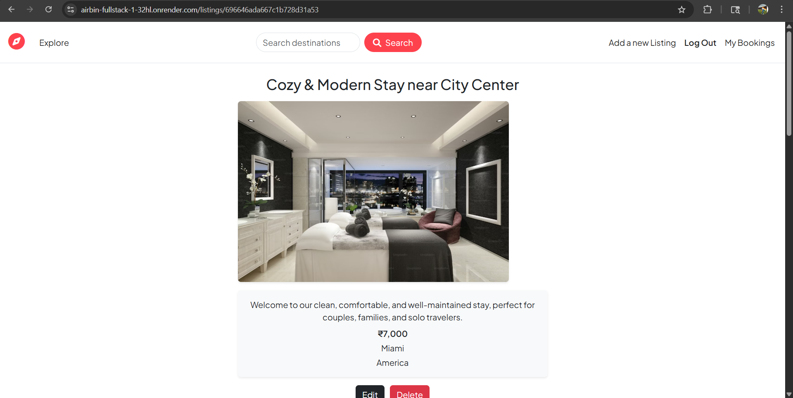
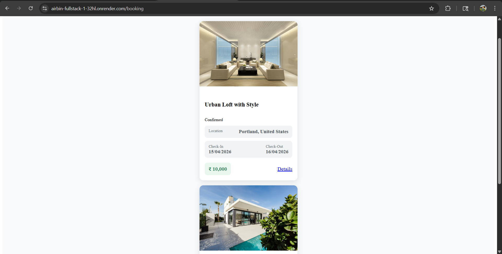

# 🌍 AIRBIN – Full Stack Airbnb Clone

A full-stack Airbnb-inspired web application that allows users to explore, manage, and book property listings with real-world features like authentication, image uploads, and map integration.

This project demonstrates production-level full-stack architecture, REST API design, and scalable backend development.

---

## 🚀 Live Demo

https://airbin-fullstack-1-32hl.onrender.com/listings

🔗 Repository:
https://github.com/Harshjadhav003/AIRBIN-FULLSTACK

---

## ❗ Problem

Managing property listings with features like booking, authentication, image uploads, and location mapping requires a scalable and well-structured full-stack system.

## 💡 Solution

Developed a complete Airbnb-like platform with authentication, booking system, wishlist, image uploads via Cloudinary, and Google Maps integration using modern web technologies.

---

## 📸 Project Preview

### 🏠 Home Page

### 📋 Listings Page

### 📄 Booking Property

---

## 🧠 Tech Stack

**Frontend:** HTML • CSS • JavaScript
**Backend:** Node.js • Express.js
**Database:** MongoDB • Mongoose
**Deployment:** Render

---

## ⚙️ Features

* 🔐 Authentication system (Signup/Login with secure password handling)
* 🏠 Full CRUD operations for property listings (Add, Edit, Delete)
* 📅 Booking system for property reservations
* 🗺️ Google Maps integration for location visualization
* 🖼️ Image upload using Cloudinary
* 🔌 RESTful API with MVC architecture
* 🌐 Fully deployed full-stack application

---

## 💡 Key Highlights

* Built a complete full-stack application with real-world features
* Implemented authentication and protected routes
* Integrated third-party services (Cloudinary, Google Maps)
* Designed scalable backend using MVC architecture

---

## 🏗️ System Architecture

Client → Express Routes → Controller → MongoDB → Response → UI

---

## 📁 Project Structure

AIRBIN-FULLSTACK
├── models/
├── routes/
├── controllers/
├── views/
├── public/
├── app.js

---

## 🔥 What I Learned

* Designing REST APIs
* Implementing MVC architecture
* Database schema design using MongoDB
* Backend deployment on Render
* Integrating third-party services

---

## 🚀 Future Improvements

* 💳 Payment integration (Razorpay/Stripe)
* 📈 Performance optimization
* ❤️ Wishlist feature to save favorite properties
* 📱 Improved UI/UX 

---

## 💼 Note

This project demonstrates my ability to build production-level full-stack applications with real-world features and scalable architecture.
