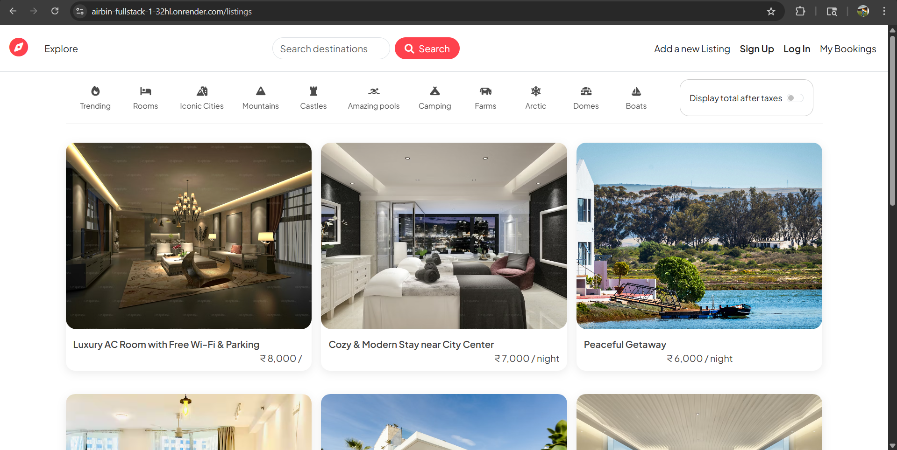

# 🏡 AIRBNB

### Full-Stack Property Rental Platform Inspired by Airbnb

AIRBNB – Full Stack Airbnb Clone | Node.js, Express.js, MongoDB, Cloudinary, Google Maps

Developed a production-ready Airbnb-inspired property rental platform with secure authentication, property management, booking functionality, image uploads, and location visualization. Implemented RESTful APIs using MVC architecture, integrated Cloudinary for media storage, and deployed the application on Render. Built scalable backend services with MongoDB and Mongoose while ensuring responsive user experience and secure session management.

  

  
  
  
  
  

---

## 🚀 Live Application

**Production URL**

https://airbin-fullstack-1-32hl.onrender.com/listings

**Source Code**

https://github.com/Harshjadhav003/AIRBNB

---

## 📌 Project Summary

The objective of AIRBNB is to replicate the core functionality of modern property rental platforms while implementing a maintainable and scalable backend architecture.

The application supports:

* Secure user authentication and authorization
* Property listing management
* Cloud-based image uploads
* Interactive location mapping
* Property booking workflows
* RESTful API architecture
* Server-side rendering using MVC principles

---

## 🎯 Business Problem

Property rental platforms require a reliable system for:

* Managing thousands of listings
* Handling user authentication securely
* Storing and serving media efficiently
* Displaying geographical locations
* Managing reservations and bookings

Developing these features while maintaining scalability, security, and performance presents significant engineering challenges.

---

## 💡 Technical Solution

AIRBNB addresses these challenges through:

* MVC-based backend architecture
* MongoDB document modeling with Mongoose
* Cloudinary-powered image storage
* Session-based authentication using Passport.js
* Google Maps integration for geolocation services
* Modular route and controller design
* Secure environment-based configuration

The result is a production-ready property rental platform demonstrating full-stack development best practices.

---

## ✨ Core Features

### Authentication & Security

* User Registration & Login
* Password Hashing
* Session Management
* Authorization Middleware
* Protected Routes

### Property Management

* Create Listings
* Edit Listings
* Delete Listings
* View Detailed Property Information
* Responsive Listing Interface

### Booking System

* Reservation Management
* Booking Workflow
* User-specific Booking Records

### Media Management

* Cloudinary Image Uploads
* Optimized Asset Delivery
* Dynamic Image Rendering

### Location Services

* Google Maps Integration
* Interactive Property Locations
* Geographical Visualization

### Backend Engineering

* RESTful API Design
* MVC Architecture
* Middleware-Based Validation
* Centralized Error Handling
* MongoDB Relationships & Data Modeling

---

## 🏗 Architecture Overview

Client → Express Router → Controllers → Services → MongoDB → Response Layer

The application follows separation of concerns principles to improve maintainability, scalability, and code organization.

---

## 📈 Key Engineering Highlights

* Designed scalable MVC architecture for maintainable development.
* Implemented secure authentication using Passport.js and Express Sessions.
* Integrated third-party cloud services including Cloudinary and Google Maps.
* Built complete CRUD functionality with robust validation workflows.
* Deployed a production-ready application on Render.
* Structured backend code using modular routing and controller patterns.

---

## 👨‍💻 About the Developer

**Harsh Jadhav**

Full Stack Developer focused on building scalable web applications using the MERN ecosystem, backend engineering principles, system design concepts, and modern deployment workflows.

### Areas of Interest

* Backend Development
* System Design
* REST API Engineering
* Docker & Containerization
* Database Design
* Cloud Deployment

GitHub:
https://github.com/Harshjadhav003

---

## ⭐ Project Status

Actively maintained and continuously improved with new features, performance optimizations, and enhanced user experience.

If you find this project valuable, consider giving it a Star ⭐.